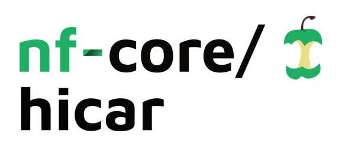
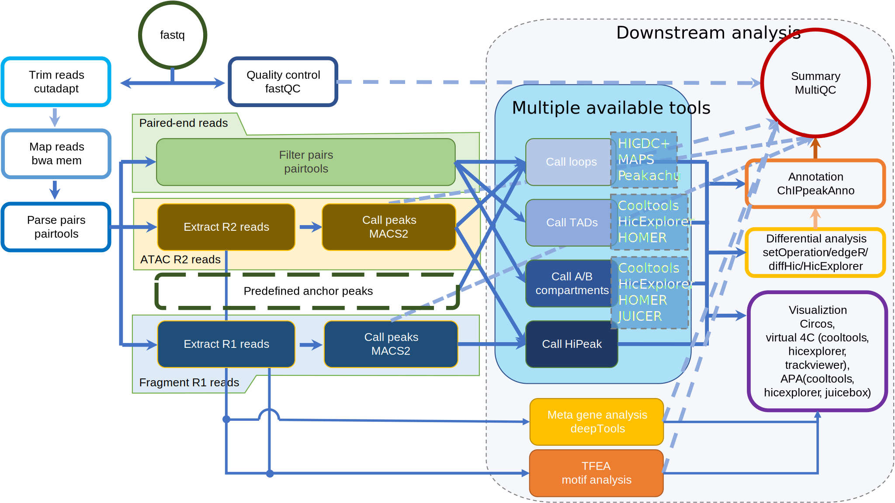

<h1>
  <picture>
    <source media="(prefers-color-scheme: dark)" srcset="docs/images/nf-core-hicar_logo_dark.png">
    
  </picture>
</h1>

[](https://github.com/nf-core/hicar/actions/workflows/ci.yml)
[](https://github.com/nf-core/hicar/actions/workflows/linting.yml)[](https://nf-co.re/hicar/results)[](https://doi.org/10.5281/zenodo.6515312)
[](https://www.nf-test.com)

[](https://www.nextflow.io/)
[](https://docs.conda.io/en/latest/)
[](https://www.docker.com/)
[](https://sylabs.io/docs/)
[](https://cloud.seqera.io/launch?pipeline=https://github.com/nf-core/hicar)

[](https://nfcore.slack.com/channels/hicar)[](https://twitter.com/nf_core)[](https://mstdn.science/@nf_core)[](https://www.youtube.com/c/nf-core)

## Introduction

**nf-core/hicar** is a bioinformatics best-practice analysis pipeline for [HiC on Accessible Regulatory DNA (HiCAR)](https://doi.org/10.1016/j.molcel.2022.01.023) data, a robust and sensitive assay for simultaneous measurement of chromatin accessibility and cis-regulatory chromatin contacts. Unlike the immunoprecipitation-based methods such as HiChIP, PlAC-seq and ChIA-PET, HiCAR does not require antibodies. HiCAR utilizes a Transposase-Accessible Chromatin assay to anchor the chromatin interactions. HiCAR is a tool to study chromatin interactions for low input samples and samples with no available antibodies.

The pipeline can also handle the experiment of HiChIP, ChIA-PET, and PLAC-Seq. It will ask user to input the peak file for the anchor peaks.

The pipeline is built using [Nextflow](https://www.nextflow.io), a workflow tool to run tasks across multiple compute infrastructures in a very portable manner. It uses Docker/Singularity containers making installation trivial and results highly reproducible. The [Nextflow DSL2](https://www.nextflow.io/docs/latest/dsl2.html) implementation of this pipeline uses one container per process which makes it much easier to maintain and update software dependencies. Where possible, these processes have been submitted to and installed from [nf-core/modules](https://github.com/nf-core/modules) in order to make them available to all nf-core pipelines, and to everyone within the Nextflow community!

On release, automated continuous integration tests run the pipeline on a full-sized dataset on the AWS cloud infrastructure. This ensures that the pipeline runs on AWS, has sensible resource allocation defaults set to run on real-world datasets, and permits the persistent storage of results to benchmark between pipeline releases and other analysis sources. The results obtained from the full-sized test can be viewed on the [nf-core website](https://nf-co.re/hicar/results).

## Pipeline summary

1. Read QC ([`FastQC`](https://www.bioinformatics.babraham.ac.uk/projects/fastqc/))
2. Trim reads ([`cutadapt`](https://cutadapt.readthedocs.io/en/stable/))
3. Map reads ([`bwa mem`](http://bio-bwa.sourceforge.net/bwa.shtml))
4. Filter reads ([`pairtools`](https://pairtools.readthedocs.io/en/latest/))
5. Quality analysis ([`pairsqc`](https://github.com/4dn-dcic/pairsqc))
6. Create cooler files ([`cooler`](https://cooler.readthedocs.io/en/latest/index.html))
7. Call peaks for ATAC reads (R2 reads) ([`MACS2`](https://macs3-project.github.io/MACS/)).
8. Call A/B compartments ([`cooltools`](https://cooltools.readthedocs.io/en/latest/index.html), [`homer`](http://homer.ucsd.edu/homer/), etc.)
9. Call TADs ([`HiCExplorer`](https://hicexplorer.readthedocs.io/en/latest/index.html), [`homer`](http://homer.ucsd.edu/homer/), etc.)
10. Find genomic interaction loops ([`MAPS`](https://github.com/ijuric/MAPS), [`HiCDCPlus`](https://doi.org/10.1038/s41467-021-23749-x), [Peakachu](https://doi.org/10.1038/s41467-020-17239-9), etc.)
11. Aggregate peak analysis ([`HiCExplorer`](https://hicexplorer.readthedocs.io/en/latest/index.html), [`Juicer_tools`](https://github.com/aidenlab/juicer/wiki), etc.)
12. Call HiPeak (high resolution analysis, time consuming, motif analysis)
13. Differential analysis ([`diffHic`](https://bioconductor.org/packages/diffHic/), etc.)
14. Annotate genomic interaction loops ([`ChIPpeakAnno`](https://bioconductor.org/packages/ChIPpeakAnno/))
15. Visualization (.mcools files [`cooler`](https://cooler.readthedocs.io/en/latest/index.html), .hic files [`Juicer_tools`](https://github.com/aidenlab/juicer/wiki), and circos files [`circos`](http://circos.ca/))
16. Pipeline reporting ([`MultiQC`](http://multiqc.info/))



## Usage

> [!NOTE]
> If you are new to Nextflow and nf-core, please refer to [this page](https://nf-co.re/docs/usage/installation) on how to set-up Nextflow. Make sure to [test your setup](https://nf-co.re/docs/usage/introduction#how-to-run-a-pipeline) with `-profile test` before running the workflow on actual data.

First, prepare a samplesheet with your input data that looks as follows:

`samplesheet.csv`:

```csv
group,replicate,fastq_1,fastq_2
CONTROL,1,AEG588A1_S1_L002_R1_001.fastq.gz,AEG588A1_S1_L002_R2_001.fastq.gz
```

Each row represents a fastq file (single-end) or a pair of fastq files (paired end).

Now, you can run the pipeline using:

```console
nextflow run nf-core/hicar \
     -profile <docker/singularity/podman/shifter/charliecloud/conda/institute> \
     --input samplesheet.csv \   # Input data
     --qval_thresh 0.01 \    # Cut-off q-value for MACS2
     --genome GRCh38 \       # Genome Reference
     --mappability /path/mappability/bigWig/file  # Provide mappability to avoid memory intensive calculation
```

> [!WARNING]
> Please provide pipeline parameters via the CLI or Nextflow `-params-file` option. Custom config files including those provided by the `-c` Nextflow option can be used to provide any configuration _**except for parameters**_;
> see [docs](https://nf-co.re/usage/configuration#custom-configuration-files).

For more details, please refer to the [usage documentation](https://nf-co.re/hicar/usage) and the [parameter documentation](https://nf-co.re/hicar/parameters).
For release candidate (RC) version, please refer to the [usage documentation](docs/usage.md) and [output documentation](docs/output.md). To setup your parameters for RC version, please refer to [parameter configureation page](https://jianhong.github.io/hicar_doc/launch.html).

## Pipeline output

To see the results of an example test run with a full size dataset refer to the [results](https://nf-co.re/hicar/results) tab on the nf-core website pipeline page.
For more details about the output files and reports, please refer to the
[output documentation](https://nf-co.re/hicar/output).

## Credits

nf-core/hicar was originally written by [Jianhong Ou](https://github.com/jianhong), [Yu Xiang](https://github.com/yuxuth), and [Yarui Diao](https://www.diaolab.org/).

We thank the following people for their extensive assistance in the development of this pipeline: Luke Zappia, James A. Fellows Yates, Phil Ewels, Mahesh Binzer-Panchal and Friederike Hanssen.

## Contributions and Support

If you would like to contribute to this pipeline, please see the [contributing guidelines](.github/CONTRIBUTING.md).

For further information or help, don't hesitate to get in touch on the [Slack `#hicar` channel](https://nfcore.slack.com/channels/hicar) (you can join with [this invite](https://nf-co.re/join/slack)).

## Citations

If you use nf-core/hicar for your analysis, please cite it using the following doi: [10.5281/zenodo.6515312](https://doi.org/10.5281/zenodo.6515312)

An extensive list of references for the tools used by the pipeline can be found in the [`CITATIONS.md`](CITATIONS.md) file.

You can cite the `nf-core` publication as follows:

> **The nf-core framework for community-curated bioinformatics pipelines.**
>
> Philip Ewels, Alexander Peltzer, Sven Fillinger, Harshil Patel, Johannes Alneberg, Andreas Wilm, Maxime Ulysse Garcia, Paolo Di Tommaso & Sven Nahnsen.
>
> _Nat Biotechnol._ 2020 Feb 13. doi: [10.1038/s41587-020-0439-x](https://dx.doi.org/10.1038/s41587-020-0439-x).
