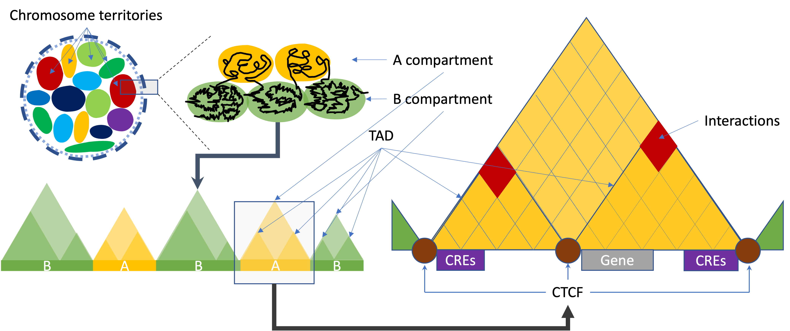

# nf-core/hicar: Usage

## :warning: Please read this documentation on the nf-core website: [https://nf-co.re/hicar/usage](https://nf-co.re/hicar/usage)

> _Documentation of pipeline parameters is generated automatically from the pipeline schema and can no longer be found in markdown files._

## Introduction

HiC on Accessible Regulatory DNA (HiCAR) is a feasible tool to study the long-range interactions
of the cis- and trans-regulatory elements (cREs/TREs) especially for the low input
samples and the samples with no available antibodies. To facilitate the analysis of HiCAR
data, the Nextflow platform based nf-core/hicar pipeline can detect the chromatin interaction
in single nucleotide resolution within and among chromosomes.

## Samplesheet input

You will need to create a samplesheet with information about the samples you would like to analzse before running the pipeline. Use this parameter to specify its location. It has to be a comma-separated file with 4 columns, and a header row as shown in the examples below.

```bash
--input '[path to samplesheet file]'
```

### Multiple runs of the same sample

The `sample` identifiers have to be the same when you have re-sequenced the same sample more than once e.g. to increase sequencing depth. The pipeline will concatenate the raw reads before performing any downstream analysis. Below is an example for the same sample sequenced across 3 lanes:

```console
group,replicate,fastq_1,fastq_2
CONTROL,1,AEG588A1_S1_L002_R1_001.fastq.gz,AEG588A1_S1_L002_R2_001.fastq.gz
CONTROL,1,AEG588A1_S1_L003_R1_001.fastq.gz,AEG588A1_S1_L003_R2_001.fastq.gz
CONTROL,1,AEG588A1_S1_L004_R1_001.fastq.gz,AEG588A1_S1_L004_R2_001.fastq.gz
```

Please Note that the dots ('.') and space (' ') in the group names will be replaced by '\_' to avoid the potential issues of python scripts. In the pipeline, the group names will be used as prefix of filenames. Many tools developed in python will consider the first dot as the sign of file extension and this will throw errors when the program does not expected the extra dots in the filenames. If you want to keep consistent of file naming system with the group names, please consider to replace all the dots and space in the samplesheet.

### Full samplesheet

HiCAR requires paired-end sequencing. Both fastq_1 and fastq_2 must be provided in the samplesheet. The samplesheet can have as many columns as you desire, however, there is a strict requirement for the first 4 columns to match those defined in the table below.

If md5_1/2 is provided, the pipeline will check the checksums.

A final samplesheet file consisting of two groups of paired-end data may look something like the one below. This is for 6 samples, where `TREATMENT_REP3` has been sequenced twice.

```console
group,replicate,fastq_1,fastq_2,md5_1,md5_2
CONTROL,1,AEG588A1_S1_L002_R1_001.fastq.gz,AEG588A1_S1_L002_R2_001.fastq.gz,,
CONTROL,2,AEG588A2_S2_L002_R1_001.fastq.gz,AEG588A2_S2_L002_R2_001.fastq.gz,,
CONTROL,3,AEG588A3_S3_L002_R1_001.fastq.gz,AEG588A3_S3_L002_R2_001.fastq.gz,,
TREATMENT,1,AEG588A4_S4_L003_R1_001.fastq.gz,AEG588A4_S4_L003_R2_001.fastq.gz,,
TREATMENT,2,AEG588A5_S5_L003_R1_001.fastq.gz,AEG588A5_S5_L003_R2_001.fastq.gz,,
TREATMENT,3,AEG588A6_S6_L003_R1_001.fastq.gz,AEG588A6_S6_L003_R2_001.fastq.gz,,
TREATMENT,3,AEG588A6_S6_L004_R1_001.fastq.gz,AEG588A6_S6_L004_R2_001.fastq.gz,,
```

| Column      | Description                                                                                                                                                                           |
| ----------- | ------------------------------------------------------------------------------------------------------------------------------------------------------------------------------------- |
| `group`     | Custom group name. This entry will be identical for multiple sequencing libraries/runs from the same sample. Spaces in sample names are automatically converted to underscores (`_`). |
| `replicate` | Biological replicates of the samples.                                                                                                                                                 |
| `fastq_1`   | Full path to FastQ file for Illumina short reads 1. File has to be gzipped and have the extension ".fastq.gz" or ".fq.gz".                                                            |
| `fastq_2`   | Full path to FastQ file for Illumina short reads 2. File has to be gzipped and have the extension ".fastq.gz" or ".fq.gz".                                                            |
| `md5_1`     | Checksum for fastq_1. The checksums of the files will be check to make sure the file is not truncated if provided.                                                                    |
| `md5_2`     | Checksum for fastq_2. The checksums of the files will be check to make sure the file is not truncated if provided.                                                                    |

An [example samplesheet](../assets/samplesheet.csv) has been provided with the pipeline.

## Different levels of 3D organization of chromatin



### Call A/B compartments and TADs

On a large scale, the arrangement of chromosomes are organised into two compartments labelled A ("active") and B ("inactive").
A/B compartment-associated regions are on the multi-Mb scale and correlate with either open and expression-active chromatin ("A" compartments) or closed and expression inactive chromatin ("B" compartments). A compartments tend to be gene-rich, have high GC-content, contain histone markers for active transcription, and usually displace the interior of the nucleus. The regions in compartment A tend to interact preferentially with A compartment-associated regions than B compartment-associated ones. B compartments, on the other hand, tend to be gene-poor, compact, contain histone markers for gene silencing, and lie on the nuclear periphery.

A topologically associating domain (TAD) is a smaller size genomic region compare to A/B compartments. It is a self-interacting genomic region. Most of the studies indicate TADs regulate gene expression by limiting the enhancer-promoter interaction to each TAD. A number of proteins are known to be associated with TAD formation. The most studied proteins are the protein CTCF and the protein complex cohesin. It has been shown that the TAD boundaries have high levels of CTCF binding and cohesin/lamina shifting edges.

There are multiple available modules to call A/B compartments and TADs.

- For A/B Compartments calling, available tools are 'cooltools', 'hicExplorer', 'Homer', and 'juicer_tools'.
- For TADs calling, available tools are 'cooltools', 'hicexplorer', and 'Homer'.

Here is a short introduction about the tools:

- The [`cooltools`](https://github.com/open2c/cooltools) leverages [`cooler`](https://github.com/open2c/cooler/tree/master/cooler) format to enable flexible and reproducible analysis of high-resolution data. `insulation` tool will be used for TADs calling.
- The [`HiCExplorer`](https://hicexplorer.readthedocs.io/en/latest/) is a set of programs to process, normalize, analyze and visualize Hi-C and cHi-C data. The [`hicFindTADs`](https://hicexplorer.readthedocs.io/en/latest/content/tools/hicFindTADs.html) will be used to call TADs.
- The [`Homer`](http://homer.ucsd.edu/homer/interactions2/HiCpca.html) is a software for motif discovery and next-gen sequencing analysis.
- The [`juicer_tools`](https://github.com/aidenlab/juicer) is a platform for analyzing bin sized Hi-C data. The [HiCTools](https://github.com/aidenlab/HiCTools) will be used to create .hic files, and call compartments. Please note that by default the normalization method for compartment calling was set as `SCALE`. You may want to try different parameters for the normalization method such as `KR`.

### Call interactions/loops

Chromatin loops (or significant interactions), represent two inter/intra chromosome regions that interact at a high frequency with one another (high reads density in sequence data). Different from HiC, HiCAR data are biased with one ends or both ends in the open chromatin. The [`MAPS`](https://github.com/ijuric/MAPS) are designed to remove the this kind of biases introduced by the ChIP or Tn5-transposition procedure. However, many tools are hesitated to introduce this kind of model-based analysis for interaction analysis since high frequency interactions must happened within the highly opened chromatin regions. Here `nf-core/hicar` provide multiple choices for interactions calling. Available tools are 'MAPS', ['HiC-DC+'](https://doi.org/10.1038/s41467-021-23749-x) and ['peakachu'](https://doi.org/10.1038/s41467-020-17239-9).

In downstream, differential analysis available for called interactions. Available tools are Bioconductor packages such as `edgeR`, and `diffhic`, and [`HiCExplorer`](https://hicexplorer.readthedocs.io/en/latest/). We borrowed capture Hi-C analysis pipeline from HiCExplorer to do the differential analysis. Different from `edgeR` and `diffhic` pipeline, HiCExplorer pipeline does not require the replicates. A simple differential analysis by set operation are also available.

For annotation, we will use Bioconductor package [`ChIPpeakAnno`](https://bioconductor.org/packages/ChIPpeakAnno/). Please note that, the involved genes are not only distance based annotation. The most of the interaction calling tools are bin-based caller, and the bin size are kilo-base or even more, which make the annotation difficult. For HiCAR data, the R2 reads are Tn5 insertion site of the open chromatin. And most of the R2 reads will be an anchor of annotion for the gene promoters. We will annotate the interactions by the annotation of called ATAC (R2) peaks located within the interaction regions.

### Call high resolution interactions

The high resolution interaction caller is also available for confident transcription factor enrichment analysis. However, please note that the high resolution interaction caller are not bin-based but peak based analysis, which uses high computational resources.

### Aggregate peak analysis

Aggregate peak analysis (APA) plots the pileup signals detected by high-resolution interaction data. It is a kind of 2 dimension meta-gene analysis. By providing a list of interested genomic coordinates, the pileup signal will present the enrichment between the interactions and the target interested region. Current available tools for APA are [`cooltools`](https://github.com/open2c/cooltools), [`HiCExplorer`](https://hicexplorer.readthedocs.io/en/latest/) and [JuicerTools](https://github.com/aidenlab/juicertools).

### Virtual 4C

Circularized Chromosome Conformation Capture (4C) is a powerful technique for studying the interactions of a specific genomic region with the rest of the genome.
Visualize Hi-C data in a virtual 4C (v4c) format can help user to zoom in the interactions within a specific viewpoint. Current available tools for v4c are [`cooltools`](https://github.com/open2c/cooltools), [`HiCExplorer`](https://hicexplorer.readthedocs.io/en/latest/) and [`trackViewer`](https://doi.org/10.1038/s41592-019-0430-y).

### Available tools

| Tools        | as paramerter | A/B compartments | TADs    | Interactions | Differential analysis | APA     | V4C     |
| :----------- | :------------ | :--------------- | :------ | :----------- | :-------------------- | :------ | :------ |
| cooltools    | cooltools     | &#9745;          | &#9745; | &#9744;      | &#9744;               | &#9745; | &#9745; |
| diffhic      | diffhic       | &#9744;          | &#9744; | &#9744;      | &#9745;               | &#9744; | &#9744; |
| edgeR        | edger         | &#9744;          | &#9744; | &#9744;      | &#9745;               | &#9744; | &#9744; |
| HiC-DC+      | hicdcplus     | &#9744;          | &#9744; | &#9745;      | &#9744;               | &#9744; | &#9744; |
| hicExplorer  | hicexplorer   | &#9745;          | &#9745; | &#9744;      | &#9745;               | &#9745; | &#9745; |
| homer        | homer         | &#9745;          | &#9745; | &#9744;      | &#9744;               | &#9744; | &#9744; |
| MAPS         | maps          | &#9744;          | &#9744; | &#9745;      | &#9744;               | &#9744; | &#9744; |
| juicer_tools | juicebox      | &#9745;          | &#9744; | &#9744;      | &#9744;               | &#9745; | &#9744; |
| peakachu     | peakachu      | &#9744;          | &#9744; | &#9745;      | &#9744;               | &#9744; | &#9744; |
| setOperation | setOperation  | &#9744;          | &#9744; | &#9744;      | &#9745;               | &#9744; | &#9744; |
| trackViewer  | trackviewer   | &#9744;          | &#9744; | &#9744;      | &#9744;               | &#9744; | &#9745; |

## Detect the contamination

If the mapping rate is extremely low (eg. < 60%), you may want to turn on `do_contamination_analysis` paramerter. The pipeline will run [Kraken2](https://ccb.jhu.edu/software/kraken2/) against [nt database](https://benlangmead.github.io/aws-indexes/k2), which is prepared from [GenBank](https://www.ncbi.nlm.nih.gov/genbank/), [RefSeq](https://www.ncbi.nlm.nih.gov/refseq/), [Third Party Annotation (TPA)](https://www.ncbi.nlm.nih.gov/genbank/tpa/) and [protein data bank (PDB)](https://www.rcsb.org/).

Note that by default the pipeline will download a huge database file and decompress it in your working directory. This will ask more than 850G free storage space. It will be a better solution if you predownload the files and feed the path via `kraken2_db` parameter.

## Running the pipeline

The typical command for running the pipeline is as follows:

```bash
nextflow run nf-core/hicar --input samplesheet.csv --outdir <OUTDIR> --genome GRCh37 -profile docker
```

This will launch the pipeline with the `docker` configuration profile. See below for more information about profiles.

Note that the pipeline will create the following files in your working directory:

```bash
work                # Directory containing the nextflow working files
<OUTDIR>            # Finished results in specified location (defined with --outdir)
.nextflow_log       # Log file from Nextflow
# Other nextflow hidden files, eg. history of pipeline runs and old logs.
```

If you wish to repeatedly use the same parameters for multiple runs, rather than specifying each flag in the command, you can specify these in a params file.

Pipeline settings can be provided in a `yaml` or `json` file via `-params-file <file>`.

> ⚠️ Do not use `-c <file>` to specify parameters as this will result in errors. Custom config files specified with `-c` must only be used for [tuning process resource specifications](https://nf-co.re/docs/usage/configuration#tuning-workflow-resources), other infrastructural tweaks (such as output directories), or module arguments (args).
> The above pipeline run specified with a params file in yaml format:

```bash
nextflow run nf-core/hicar -profile docker -params-file params.yaml
```

with `params.yaml` containing:

```yaml
input: './samplesheet.csv'
outdir: './results/'
genome: 'GRCh37'
input: 'data'
<...>
```

You can also generate such `YAML`/`JSON` files via [nf-core/launch](https://nf-co.re/launch).

### Updating the pipeline

When you run the above command, Nextflow automatically pulls the pipeline code from GitHub and stores it as a cached version. When running the pipeline after this, it will always use the cached version if available - even if the pipeline has been updated since. To make sure that you're running the latest version of the pipeline, make sure that you regularly update the cached version of the pipeline:

```bash
nextflow pull nf-core/hicar
```

### Reproducibility

It is a good idea to specify a pipeline version when running the pipeline on your data. This ensures that a specific version of the pipeline code and software are used when you run your pipeline. If you keep using the same tag, you'll be running the same version of the pipeline, even if there have been changes to the code since.

First, go to the [nf-core/hicar releases page](https://github.com/nf-core/hicar/releases) and find the latest pipeline version - numeric only (eg. `1.3.1`). Then specify this when running the pipeline with `-r` (one hyphen) - eg. `-r 1.3.1`. Of course, you can switch to another version by changing the number after the `-r` flag.

This version number will be logged in reports when you run the pipeline, so that you'll know what you used when you look back in the future. For example, at the bottom of the MultiQC reports.

To further assist in reproducbility, you can use share and re-use [parameter files](#running-the-pipeline) to repeat pipeline runs with the same settings without having to write out a command with every single parameter.

> 💡 If you wish to share such profile (such as upload as supplementary material for academic publications), make sure to NOT include cluster specific paths to files, nor institutional specific profiles.

## Core Nextflow arguments

> **NB:** These options are part of Nextflow and use a _single_ hyphen (pipeline parameters use a double-hyphen).

### `-profile`

Use this parameter to choose a configuration profile. Profiles can give configuration presets for different compute environments.

Several generic profiles are bundled with the pipeline which instruct the pipeline to use software packaged using different methods (Docker, Singularity, Podman, Shifter, Charliecloud, Apptainer, Conda) - see below.

> We highly recommend the use of Docker or Singularity containers for full pipeline reproducibility, however when this is not possible, Conda is also supported.

The pipeline also dynamically loads configurations from [https://github.com/nf-core/configs](https://github.com/nf-core/configs) when it runs, making multiple config profiles for various institutional clusters available at run time. For more information and to see if your system is available in these configs please see the [nf-core/configs documentation](https://github.com/nf-core/configs#documentation).

Note that multiple profiles can be loaded, for example: `-profile test,docker` - the order of arguments is important!
They are loaded in sequence, so later profiles can overwrite earlier profiles.

If `-profile` is not specified, the pipeline will run locally and expect all software to be installed and available on the `PATH`. This is _not_ recommended, since it can lead to different results on different machines dependent on the computer enviroment.

- `test`
  - A profile with a complete configuration for automated testing
  - Includes links to test data so needs no other parameters
- `docker`
  - A generic configuration profile to be used with [Docker](https://docker.com/)
- `singularity`
  - A generic configuration profile to be used with [Singularity](https://sylabs.io/docs/)
- `podman`
  - A generic configuration profile to be used with [Podman](https://podman.io/)
- `shifter`
  - A generic configuration profile to be used with [Shifter](https://nersc.gitlab.io/development/shifter/how-to-use/)
- `charliecloud`
  - A generic configuration profile to be used with [Charliecloud](https://hpc.github.io/charliecloud/)
- `apptainer`
  - A generic configuration profile to be used with [Apptainer](https://apptainer.org/)
- `conda`
  - A generic configuration profile to be used with [Conda](https://conda.io/docs/). Please only use Conda as a last resort i.e. when it's not possible to run the pipeline with Docker, Singularity, Podman, Shifter, Charliecloud, or Apptainer.

### `-resume`

Specify this when restarting a pipeline. Nextflow will use cached results from any pipeline steps where the inputs are the same, continuing from where it got to previously. For input to be considered the same, not only the names must be identical but the files' contents as well. For more info about this parameter, see [this blog post](https://www.nextflow.io/blog/2019/demystifying-nextflow-resume.html).

You can also supply a run name to resume a specific run: `-resume [run-name]`. Use the `nextflow log` command to show previous run names.

### `-c`

Specify the path to a specific config file (this is a core Nextflow command). See the [nf-core website documentation](https://nf-co.re/usage/configuration) for more information.

## Custom configuration

### Resource requests

Whilst the default requirements set within the pipeline will hopefully work for most people and with most input data, you may find that you want to customise the compute resources that the pipeline requests. Each step in the pipeline has a default set of requirements for number of CPUs, memory and time. For most of the steps in the pipeline, if the job exits with any of the error codes specified [here](https://github.com/nf-core/rnaseq/blob/4c27ef5610c87db00c3c5a3eed10b1d161abf575/conf/base.config#L18) it will automatically be resubmitted with higher requests (2 x original, then 3 x original). If it still fails after the third attempt then the pipeline execution is stopped.

To change the resource requests, please see the [max resources](https://nf-co.re/docs/usage/configuration#max-resources) and [tuning workflow resources](https://nf-co.re/docs/usage/configuration#tuning-workflow-resources) section of the nf-core website.

### Custom Containers

In some cases you may wish to change which container or conda environment a step of the pipeline uses for a particular tool. By default nf-core pipelines use containers and software from the [biocontainers](https://biocontainers.pro/) or [bioconda](https://bioconda.github.io/) projects. However in some cases the pipeline specified version maybe out of date.

To use a different container from the default container or conda environment specified in a pipeline, please see the [updating tool versions](https://nf-co.re/docs/usage/configuration#updating-tool-versions) section of the nf-core website.

### Custom Tool Arguments

A pipeline might not always support every possible argument or option of a particular tool used in pipeline. Fortunately, nf-core pipelines provide some freedom to users to insert additional parameters that the pipeline does not include by default.

To learn how to provide additional arguments to a particular tool of the pipeline, please see the [customising tool arguments](https://nf-co.re/docs/usage/configuration#customising-tool-arguments) section of the nf-core website.

### nf-core/configs

In most cases, you will only need to create a custom config as a one-off but if you and others within your organisation are likely to be running nf-core pipelines regularly and need to use the same settings regularly it may be a good idea to request that your custom config file is uploaded to the `nf-core/configs` git repository. Before you do this please can you test that the config file works with your pipeline of choice using the `-c` parameter. You can then create a pull request to the `nf-core/configs` repository with the addition of your config file, associated documentation file (see examples in [`nf-core/configs/docs`](https://github.com/nf-core/configs/tree/master/docs)), and amending [`nfcore_custom.config`](https://github.com/nf-core/configs/blob/master/nfcore_custom.config) to include your custom profile.

See the main [Nextflow documentation](https://www.nextflow.io/docs/latest/config.html) for more information about creating your own configuration files.

If you have any questions or issues please send us a message on [Slack](https://nf-co.re/join/slack) on the [`#configs` channel](https://nfcore.slack.com/channels/configs).

## Azure Resource Requests

To be used with the `azurebatch` profile by specifying the `-profile azurebatch`.
We recommend providing a compute `params.vm_type` of `Standard_D16_v3` VMs by default but these options can be changed if required.

Note that the choice of VM size depends on your quota and the overall workload during the analysis.
For a thorough list, please refer the [Azure Sizes for virtual machines in Azure](https://docs.microsoft.com/en-us/azure/virtual-machines/sizes).

## Running in the background

Nextflow handles job submissions and supervises the running jobs. The Nextflow process must run until the pipeline is finished.

The Nextflow `-bg` flag launches Nextflow in the background, detached from your terminal so that the workflow does not stop if you log out of your session. The logs are saved to a file.

Alternatively, you can use `screen` / `tmux` or similar tool to create a detached session which you can log back into at a later time.
Some HPC setups also allow you to run nextflow within a cluster job submitted your job scheduler (from where it submits more jobs).

## Nextflow memory requirements

In some cases, the Nextflow Java virtual machines can start to request a large amount of memory.
We recommend adding the following line to your environment to limit this (typically in `~/.bashrc` or `~./bash_profile`):

```bash
NXF_OPTS='-Xms1g -Xmx4g'
```

## Troubleshooting

- Error: `The exit status of the task that caused the workflow execution to fail was: null.`

Check the files are readable for the workflow.

- Error: `Session aborted -- Cause: Unable to execute HTTP request: ngi-igenomes.s3.amazonaws.com`

The internet connection reached the limitation. Try to resume the analysis one hour later.

- Error: `PaddingError: Placeholder of length '80' too short in package`

There is no easy answer here. The new `conda` packages should having a longer prefix (255 characters).
The possible solution now is that try to run the pipeline in a shorter folder path, if at all possible.

- Error: `Not a conda environment` or `command not found`

There is something going wrong with the conda environment building.
Just try to remove the conda environment folder and resume the run.

- Error: `unable to load shared object 'work/conda/env-xxxxxx/lib/R/library/rtracklayer/libs/rtracklayer.dylib', dlopen(rtracklayer.dylib, 6) Library not loaded: @rpath/libssl.1.1.dylib`

The openssl installation have issues for `conda`. Try to reinstall it by
`conda activate work/conda/env-xxxxxx && conda install --force-reinstall -y openssl`

- Error: `error Can't locate Statistics/Basic.pm`

The perl-statistics-basic installed in wrong location. Try to reinstall it by
`conda activate work/conda/env-xxxxx && perl -MCPAN -e 'CPAN::install(Statistics::Basic)'`

- `Error in result[[njob]] <- value : attempt to select less than one element in OneIndex`

The error may caused by out of memory (although the error message seems to be unrelated to memory). Try to set `--peak_pair_block` to a smaller number less than 1e9.

- `[CRITICAL] The sample sheet **must** contain these column headers: replicate, group, fastq_2, fastq_1.`

The error may caused by the improper formtated `.csv` file (the file contain header info before the column names) by `Microsoft Excel`. Please use a text editor to reprepare the `.csv` sample files.

- `.command.sh: line 2: gtf2bed: command not found` or `.command.sh: line 1: check_samplesheet.py: command not found`.

When you are using container and your nextflow home folder is a symlink, the bin folder in the source code will be not available in the container.

### Known issue with Juicer_tools

If you are using [Juicer_tools](https://github.com/aidenlab/juicer/wiki/) with GPU supported, it is not supported by the containers. We are using [Juicer Tools Pre](https://github.com/aidenlab/juicer/wiki/Pre) to create the [hic files](https://doi.org/10.1016/j.cels.2016.07.002) from aligned HiCAR reads.
We recommend having at least 4GB free RAM to generate the hic files.

### Tips for HPC Users

When using an HPC system you should specify the executor matching your system. Check [available executors](https://www.nextflow.io/docs/latest/executor.html) to use the correct executor and parameters.
This instructs Nextflow to submit pipeline tasks as jobs into your HPC workload manager.
Take SLURM workload manager system as an example for the minimal test, this can be done adding the following lines to the `nextflow.config`.

```nextflow
process.executor = 'slurm' // the workload manager name
executor {// the job queue size
    name = 'slurm'
    queueSize = 10
}
process.clusterOptions = "-J nextFlowHiCAR -p scavenger" // the options, here -p request a specific partition for the resource allocation. It will be different in your cluster.
```

### Useful resources

- [Nextflow pipeline configuration](https://nf-co.re/usage/configuration)

- [Troubleshooting documentation](https://nf-co.re/docs/usage/troubleshooting)
